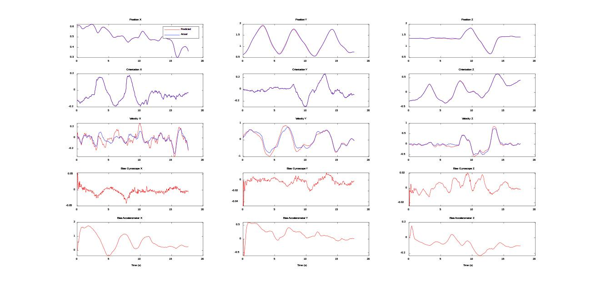
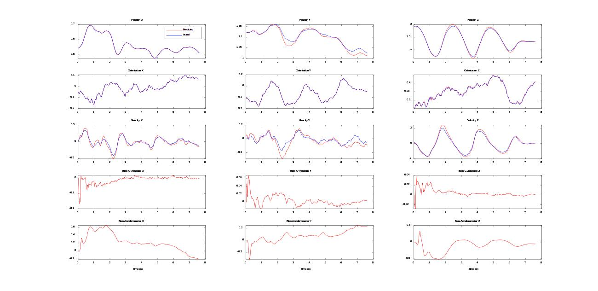
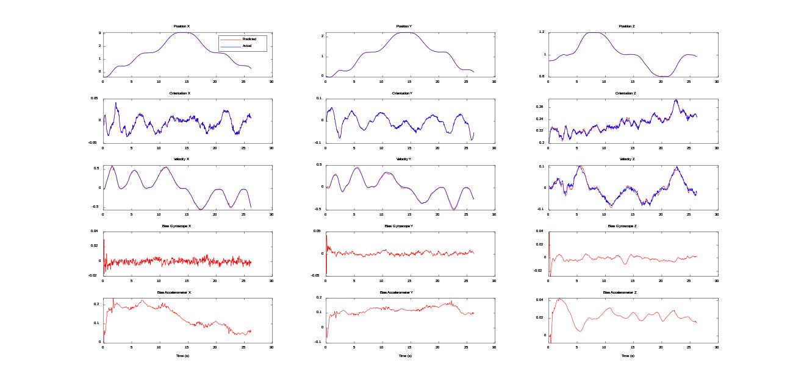
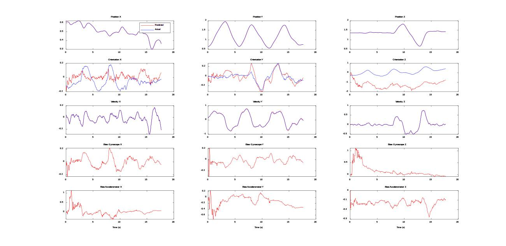
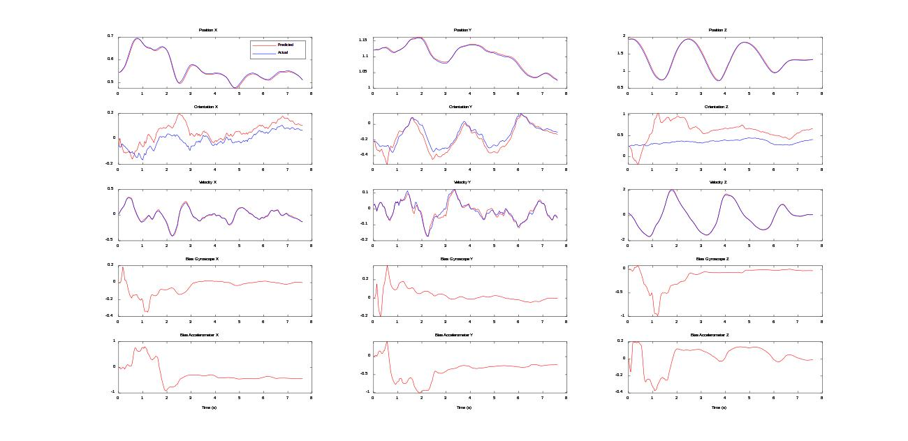
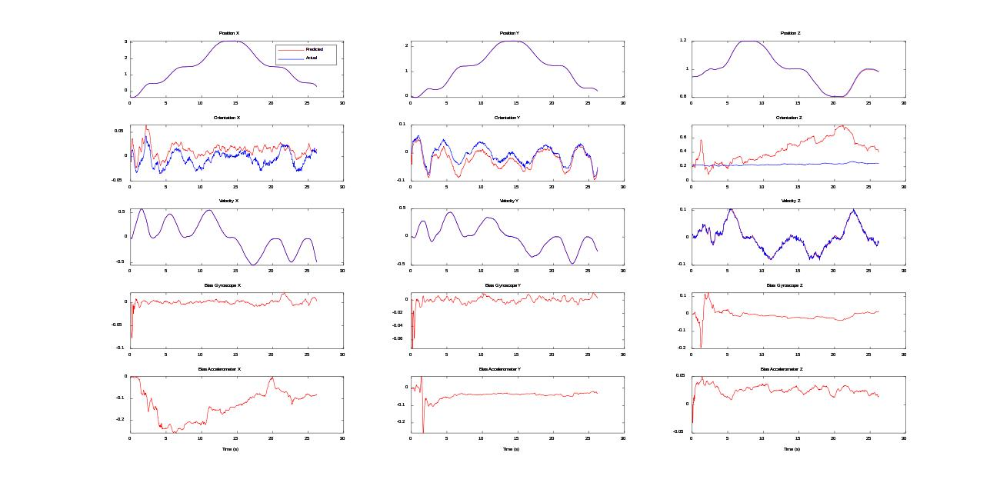

# EKF_Vicon_IMU_State_Estimation
### 3D State Estimation with IMU and Vicon(Pose). There are 3 different datsets
[Dataset1]

[Dataset4]

[Dataset9]

### 3D State Estimation with IMU and Vicon(Linear Velocity). There are 3 different datsets
[Dataset1]

[Dataset4]

[Dataset9]

